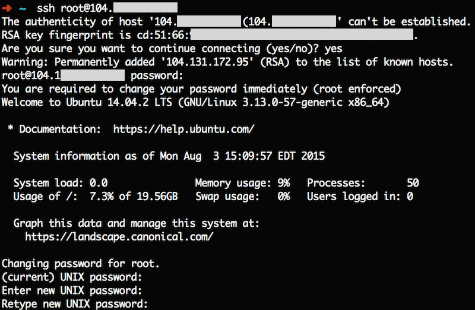
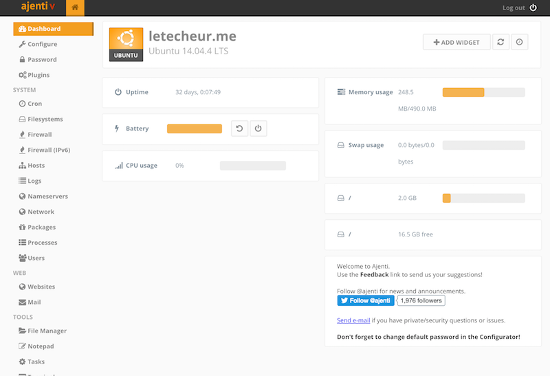
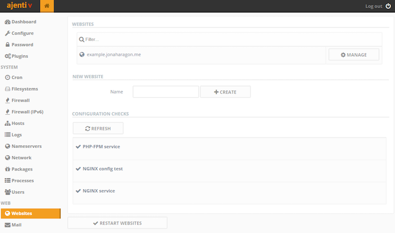
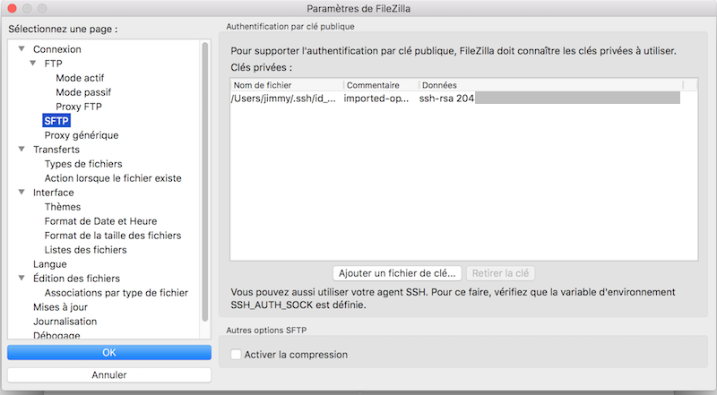

# Créer un serveur web avec Digital Ocean

Grâce à l'offre étudiants de chez Github, nous disposons d'un bonus de 50\$ + 10\$, soit 60\$ sur DigitalOcean.com. Ce qui équivaut à un an d'hébergement gratuit. Ce serait dommage de s'en priver.

Le problème est qu'il s'agit d'un VPS ( *virtual private server* ou serveur dédié virtuel ). En résumé, c'est une machine virtuelle sur laquelle vous installez ce que vous voulez. Et qui dit serveur privé, dit configuration complète et totale. Vous allez devoir créer vos machines virtuelles, configurer vos hostsnames, installer les bons packages, installer votre serveur web, votre serveur mail, etc. J'ai décidé de faire un récapitulatif de l'installation pour m'aider et je vous la partage. Alors pas de panique, ce n'est pas compliqué ! 

## Étape 1 - Acheter son nom de domaine.

La première étape pour apparaître sur le web est d'acheter son nom de domaine. Vous pouvez le faire sur [OVH](https://www.ovh.com/fr/), c'est sécurisé et ce sont des professionnels reconnus.  

1. Ovh va vous demander si vous désirez utiliser un DNS BOOST ou un classique. Prenez le classique.
- Sur la même page, sélectionnez l'offre « Gold », elle est gratuite et suffit.
- Sur la page suivante, OVH demande si vous désirez un hébergement avec le domaine. Comme nous allons utiliser DigitalOcean, choisissez que vous n'en vouliez pas.
- Ensuite, continuez la procédure d'achat et inscrivez-vous.
- **Sur la dernière page, OVH va vous demander si vous désirez utiliser leurs serveurs DNS ou un serveur personnalisé. Sélectionnez « *Personnaliser vous même vos serveurs* »**
Indiquez dans les 3 premier champs « Nom du serveur DNS » les serveurs suivant :  

- ns1.digitalocean.com  
- ns2.digitalocean.com  
- ns3.digitalocean.com

Ensuite, passez à la caisse et payez-les quelques euros pour finaliser votre commande. Une fois que vous recevez la confirmation d'OVH comme quoi votre nom de domaine est actif, c'est le moment de se rendre sur [DigitalOcean](http://digitalocean.com).

## Étape 2 - S'inscrire sur DigitalOcean.

Inscrivez-vous sur DigitalOcean. La première chose à faire une fois inscrite est d'y inscrire une carte de crédit (ils ne perdent pas de temps!) ou son compte PayPal. Personnellement, j'ai choisi la méthode carte de crédit. Elle ne sera **PAS** débitée. Ils vont juste faire une vérification de 0,00€ pour voir si elle est active. Attention, vous allez peut-être recevoir un appel de votre banque pour demander si c'est vous qui avez réalisé la transaction (car en Belgique, les transactions sur carte bancaire d'un montant de 0€ sont interdites). Avec PayPal, c'est sans doute plus simple, mais vous êtes obligé de charger votre compte d'au moins 5$, à vous de voir.

Une fois votre carte validée, dans « Promo code » mettez-y le coupon GitHub que vous avez reçu avec votre student education pack concernant DigitalOcean. Et boum, **50\$ gratos** ! Et comme à l'inscription, on reçoit 10\$, ça fait 60\$ en tout !

## Étape 3 - Créer sa machine virtuelle

Sur DigitalOcean, les machines virtuelles s'appellent des « Droplets ». En haut à droite, cliquer sur " Create a droplet ".

1. Choisissez votre distribution. Ce tutoriel se base sur Ubuntu, donc sélectionnez-le.
2. Choisissez une taille. Pour un portfolio, la plus petite suffit (celle à 5$/m). 20Gb de SSD est amplement suffisant. Si dans le futur vous avez besoin de plus de performances, vous pourrez adapter votre serveur quand vous le voudrez.
3. Choisissez un datacenter proche de chez vous. Comme le portfolio sera en principe le plus souvent visité par des clients/professeurs/employeurs, il y a des chances pour qu'ils habitent pas loin de la Belgique. Perso, j'ai choisi Amsterdam.
4. Ajouter des options si vous le voulez. Certaines sont payantes. Perso, je n'en ai pas pris.
5. Pour la clé SSH, on la créera plus tard.
6. Ne créez qu'un droplet. Donnez un nom à votre droplet ou laissez le nom proposé. Cliquer sur « Create a droplet ».

## Étape 4 - Configurer la partie réseau de son serveur

Une fois votre droplet créer, vous avez reçu un mail avec un nom d'utilisateur et un mot de passe. Conservez-le, vous en aurez besoin plus tard.

Pour cette partie, cliquez sur " More ", à droite du nom de votre droplet et sélectionnez " Add a domain ". Dans le champ adéquat, inscrivez-y votre nom de domaine (ex: letecheur.me). Vous allez arriver sur une page, où il sera inscrit " Select Record Type ". 

C'est sur cette page-ci que vous allez configurer tout ce qui se rapporte à votre nom de domaine, au réseau, etc.

Les "A" sont les champs qui se rapportent à l'accès de votre serveur. De base, on peut accéder à son serveur via l'adresse IP qui vous est fournie (ici, 146.185.175.216). DigitalOcean est gentil, il nous a associé notre nom de domaine à notre adresse IP (le @ signifie notre nom de domaine).

Maintenant, il reste à associer quelques éléments supplémentaires, dont nous aurons besoin par la suite.

La première est d'ordre ergonomique. On a l'habitude d'écrire "www.nomdedomaine.com", mais ici le site ne sera accessible que par nomdedomaine.com. Pour palier à cet effet, on va créer un A-name avec "www". 

Lorsque notre serveur web sera en place, on pourra donc écrire *letecheur.me* ou *www.letecheur.me* !  
Vous pourriez aussi imaginer mettre "wwww" devant, pour pallier à la faute de frappe d'un utilisateur.

Ensuite, créer un autre A-name, un **panel** qui servira à l'installation d'Ajenti, un gestionnaire de serveur (et de site web) qui se gère à la souris (youpi!).

Pour les configurations mail, on verra plus tard…

## Étape 5 - Tester si votre serveur vous reçoit.

À cette étape-ci, vous devriez être en mesure de réaliser un ping vers votre serveur. Ouvrez-votre terminal et tappez :

`Ping adresseipdevotreserveur`
ou
`Ping votrenomdedomaine`

Faite CTRL + C pour arrêter le ping. Si les paquets ont été reçus, c'est ok !

/!\ À noter que faire un ping vers votre nom de domaine peut ne pas fonctionner instantanément. En effet, le A-Name peut prendre du temps à s'initialiser. Donc si ça ne fonctionne pas tout de suite et que vous avez suivi les étapes, c'est peut-être normal. Quoi qu'il en soit, ça devrait fonctionner pour votre adresse ip.

## Étape 6 - SSH pour plus de sécurité

Avant de commencer, il faut établir une connexion SSH avec le serveur. C'est une manière sécurisée d'y accéder et autant prendre les bonnes habitudes directement. 

Pour cela, l'opération va varier en fonction de votre système. Sur MAC, c'est plus simple que sur Windows (Windaube comme dirait M. Gérard).

Pour Windows, vous aurez besoin d'installer [Putty](http://www.putty.org/), un client SSH. Sur Mac, pas besoins, ça fonctionne nativement.

### Pour MAC

1. Se connecter au serveur avec la commande suivante dans le terminal : `ssh root@IP_DE_VOTRE_DROPLET`
2. La première fois que vous tenterez la connexion, vous aller reçevoir un avertissement. Tappez `yes`
3.  On vous demande un mot de passe. Prenez celui de l'email dont je vous ai parlé précédemment. Coller le dans l'invite de commande.
4.  Coller le à nouveau.
5.  Donnez un nouveau mot de passe ( **ET NOTEZ LE QUELQUE PART !** )
6.  Répetez votre nouveau mot de passe ( **ET VRAIMENT, NOTEZ-LE QUELQUE PART !** )

Vous êtes maintenant connectez en SSH. Vous pouvez passer à l'étape suivante.

### Pour WINDOWS

*Avant de commencer à vous expliquer les étapes, sachez que je ne les aient pas tester travaillant principalement sous MAC.*

Lancez Putty.exe et suivez les étapes suivantes :

1. Configurer la connexion en s'assurant que les paramètres de connexion suivante sont bien corrects : 
	- Host Name (or IP address): Entrez l'adresse IP de votre serveur ici.
	-  Port: 22 (default)
	- Connection Type: SSH (default) 
	- Vous pouvez maintenant nommer et sauvegarder cette connexion pour une utilisation future en tapant un nom dans le champ "Saved Sessions", et en cliquant sur "enregistrer"

2. Lancer la connexion. Double-cliquez sur le nom de la session, et acceptez l'alerte de sécurité (ça apparaît la première fois que vous vous connectez au serveur).

3. C'est maintenant qu'il faut se connecter. Suivez ces étapes.
	- Dans `login as` entrez `root`
	- Dans `Password prompt` entrez le mot de passe que vous avez reçu par email de la part de DigitalOcean
	- Dans `(current) UNIX password` entrez à nouveau le mot de passe reçu par DigitalOcean
	- Dans `Enter new UNIX password` entrez votre nouveau mot de passe (**ET SAUVEGARDEZ-LE QUELQUE PART**)
	- Dans `Retype new UNIX password` entrez à nouveau votre nouveau mot de passe (**ET SAUVEGARDEZ-LE SI VOUS NE L'AVEZ PAS ENCORE FAIT**)

Vous êtes maintenant connecté en SSH. Vous pouvez passer à l'étape suivante.

## Étape 7 - Configurer un utilisateur son serveur

Maintenant que vous êtes connecté, il faut configurer la base du serveur. Suivez les étapes suivantes :

- Ajouter un nouvel utilisateur avec la commande suivante `adduser votrenomdutilisateur`

Il vous sera demandé quelques questions. Choisissez un mot de passe (**ET NOTEZ-LE QUELQUE PART, AU MÊME ENDROIT OU VOUS AVEZ SAUVEGARDÉ VOTRE MOT DE PASSE ROOT**)et répondez aux questions demandées si vous en avez envie.

- Ajouter l'utilisateur au groupe SUDO avec la commande suivante `gpasswd -a votrenomdutilisateur sudo`

**Notes :** vous pouvez décider d'installer une clé SSH privée sur votre machine et sur votre serveur pour plus de sécurité. C'est conseillé. Je vous laisse le loisir de le faire par vous même, ce n'est pas indispensable pour la suite du tutoriel.

## Étape 8 - Installer le control panel AJENTI V

Ajenti V est un gestionnaire de contrôle qui va vous permettre de gérer votre serveur dans un navigateur web. Il est pratique et simple d'accès.

1. Si ce n'est pas déjà fait, connectez-vous en SSH à votre serveur. Connectez-vous avec l'utilisateur créé précédemment. Pour rappel, connectez-vous en utilisant `ssh nomdutilisateur@ipdevotreserveur`.

2. Tappez la commande suivante qui sert à valider les paquets que vous aller télécharger.  
`wget http://repo.ajenti.org/debian/key -O- | sudo apt-key add -`

3. Ajouter le repo à notre liste de sources : 
`echo "deb http://repo.ajenti.org/ng/debian main main ubuntu" | sudo tee -a /etc/apt/sources.list`
4. Lancer le processus d'installation   
`sudo apt-get update && sudo apt-get install ajenti`  
Tappez Y peut ENTRER. L'opération d'installation peut prendre plusieurs minutes.
5. Relancer Ajenti  
`sudo service ajenti restart`.  
Si vous voyez `Started` sur la dernière ligne, c'est que c'est bon.

## Étape 9 - Configurer AJENTI

- Maintenant qu'Ajenti V est installé, rendez-vous sur le panel contrôle. 

`https://panel.votre_nom_de_domaine:8000/`

*/!\ Vous allez avoir une erreur comme quoi le site n'est pas sécurisé. C'est normal. Continuez !*

- Connectez vous à Ajenti
	- **Username :** root
	- **Password :** admin

- La première chose à faire est de changer le mot de passe par défaut. Cliquez sur Password en haut à gauche. Donnez l'ancien mot de passe dans `old password` et tapez le nouveau dans les champs suivants.

- Une fois le mot de passe changé. Cliquez sur "Configure" et descendez en bas et cliquez sur "Restart".
- Voilà Ajenti V est installé. Vous pouvez explorer toutes les options qu'il vous offre. Mais pour le moment, il n'est pas configuré pour recevoir des sites web. Pour ce faire, lisez l'étape suivante.

## Configurer Ajenti pour y installer un site web

Pour installer le plugin qui permettra à Ajenti d'installer et de lire des sites webs sur le serveur, connectez-vous en SSH à votre serveur et tappez-y la commande suivante :

- `apt-get install ajenti-v ajenti-v-nginx ajenti-v-mysql ajenti-v-php-fpm ajenti-v-mail ajenti-v-nodejs php5-mysql`

Vous allez avoir des alertes, appuyez sur "Yes" et enter.

Ça va installer le serveur web **NGINX** (et non Apache, d'après mes recherches, NGINX est performant sur le front-end qu'Apache). Ajenti ne fonctionne qu'avec NGINX. La commande va aussi installer **MYSQL**, **PHP**, un serveur mail, **NODE.JS**,…

Si MYSQL vous demande des mots de passe, vous pouvez simplement appuyer sur enter à plusieurs reprises. Une fois le tout installé, redémarrez AJENTI.

Une fois qu'AJENTI aura redémarré, vous verrez une section WEB dans votre dashboard. 

## Installer un site web sur son serveur ( ENFIN !!! )

Pour commencer, on va avoir besoins de retourner dans le point 4 **Configurer la partie réseau de son serveur**. Pour cela, allez à l'accueil de DigitalOcean. Sur votre Droplet, cliquez à gauche sur "More" puis "Add a domain". Ensuite, cliquez sur la loupe à coter de votre nom de domaine.

On va ajouter un MX pour les mails. **Notez bien que votre nom de domaine doit se terminer par un point comme sur l'image**

Et un TXT Record

Remplacer les champs temporaire par les bonnes valeurs.

#### Créer le dossier de votre site web

Sur Ajenti, entrez dans la section *Web*. Cliquez sur *Website*. Cliquez sur *Activer*. Dans "New Website", sous le champ "Name", donner un nom à votre site web. Ensuite, créer sur "Create".

Une fois créé, cliquez sur "Manage" à côté du nom de votre site web. Dans le champ "path", changez `/srv/new-website`, par `/srv/votredomaine.com`. Cliquez sur le bouton "Set". Cliquez aussi sur "Create Directory"

Ensuite, décocher la checkbox "Maintenance Mode". Appliquez vos changements en bas de page.

Maintenant, cliquez sur l'onglet "Domains". Ajoutez votre nom de domaine dans le champ adéquat. Appliquez vos changements.

---
Maintenant que vous avez un dossier, vous pouvez téléverser vos fichiers sur votre serveur. Pour ce faire, connectez-vous à votre serveur avec FileZilla.

Pour cela, on va avoir besoin de se créer des fichiers d'authentifications en SSH. On pourrait le faire en FTP, mais ce n'est vraiment pas conseillé. 

En résumé, une clé SSH va créer deux fichiers. Une clé publique qui sera stockée sur le serveur et une clé privée sur votre machine, qui servira à déchiffrer la clé publique.

Comme d'habitude, c'est plus compliqué sur Windows que sur MAC. 

#### Pour MAC

1. Tappez dans le terminal : `ssh-keygen -t rsa`. Vérifiez bien que vous n'êtes pas connecté à votre serveur. Cette opération s'effectue sur la machine client.
2. Une fois la commande entrée, vous aurez quelques questions. On vous demandera ou stocker votre clé ssh. Par défaut, ce sera enregistré dans `/home/votrenomdutilisateur/.ssh/id_rsa)`.   
**Notez que si vous ne changez pas le chemin, votre clé sera stockée dans un fichier caché. Vous devrez donc les rendre visible pour accéder au dossier. Ou vous pouvez simplement modifier le chemin de base**
3. Vous pouvez décider d'entrer un mot de passe (passphrase). Ce n'est pas obligé. Bien sur c'est mieux, si une personne mal intentionnée arrive à avoir votre clé privée, elle ne sera pas en mesure de se connecter sans son mot de passe.
4. Une fois l'opération terminée, vous aurez un message avec un motif étrange.
5. Aller dans le dossier dans laquelle vous avez stocké vos clés. La clé publique s'appelle `id_rsa.pub` et la privée `id_rsa`.

La prochaine étape est de placer la clé publique sur le serveur.

Pour avoir plus simple, on va avoir besoins d'utiliser le script ssh-copy-id.  

Installer Homebrew avec le code suivant 
`/usr/bin/ruby -e "$(curl -fsSL https://raw.githubusercontent.com/Homebrew/install/master/install)"`

Ensuite, tappez dans le terminal : `brew install ssh-copy-id`

Une fois celà fait, commencez la copie de votre clé publique vers votre serveur avec la commande suivante : `ssh-copy-id nomdutilisateur@IPdevotreserveur`

Vous devriez avoir un texte qui confirme la copie de votre clé publique sur le serveur. Passez à Filezilla.

#### Pour WINDOWS
Je ne connais pas la méthode et je ne l'ai jamais testée. Je vous renvoie vers un très bon tutoriel sur le site de DigitalOcean. Si vous suivez les étapes, il ne devrait pas y avoir de problèmes.

[Vers le tutoriel](https://www.digitalocean.com/community/tutorials/how-to-create-ssh-keys-with-putty-to-connect-to-a-vps)

---

- Ouvrez Filezilla.
- Allez dans les paramètres.
- Cliquez sur SFTP
- Cliquez sur "Ajouter une clé" et selectionnez votre clé privée ssh (ne pas sélectionner celle qui se termine par .pub). Filezilla peu vous demander de convertir votre clé, acceptez.

*Note : Si vous n'arrivez pas à acceder au dossier parce qu'il est caché, vous pouvez ouvrir le dossier dans le finder et simplement faire glisser la clé sur FileZilla*

- Ensuite allez dans "Fichier -> Gestionnaire de sites".
- Ajouter un nouveau site, dans "Hôte", indiquez votre nom de domaine ou l'adresse IP de votre serveur.
- Indiquez le port n°22 (par défaut)
- Sélectionnez le protocole "SFTP - SSH File Transfer Protocol"
- Sélectionnez le type d'interaction interactif. 
- Dans "Identifiant" mettez le nom d'utilisateur de votre serveur. Ne mettez rien dans mot de passe.
- Ensuite, cliquez sur "Connexion". Votre serveur peut vous demander un identifiant (votre pseudo) et un mot de passe (si vous avez mit un passphrame à votre clé SSH).
- Une fois que vous êtes connecté, naviguer jusqu'au dossier de votre site web. Normalement : `/srv/ledossierdevotresite`.

Félicitation ! Vous êtes connecté avec FileZilla à votre serveur distant ! Dans votre dossier, mettez-y un fichier index.html HTML et rendez-vous sur votre nom de domaine grâce à votre navigateur préféré ! Et bingo, **ça fonctionne !**

### Creer un compte mail avec Ajenti

C'est cette partie qui m'a pris le plus de temps. En effet, se créer un compte mail ce n’est pas compliqué. Faire en sorte que les mails soient reçus dans la boîte désirable des personnes que l'on essaie de contacter, c'est une autre affaire. J'ai quand même réussi après de longues recherches et de nombreux tests !

- Retourner dans votre Ajenti. Dans la section WEB, cliquez sur Mail.
- Cliquez sur le bouton "Activer" si vous êtes invité à le faire.
- Dans "New Mailbox", dans le champ "Address", indiquez le préfixe de votre adresse email. Par exemple votre prénom. 
- Ensuite, à droite du "@", sélectionnez votre nom de domaine. Si c'est "letecheur.me", vous aurez une adresse "jimmy@letecheur.me". Si ça n'apparaît pas, vous pouvez choisir "custom domain" et inscrire en dessous votre nom de domaine.
- Maintenant que votre adresse apparaît dans la section "Mailboxes", cliquez dessus et cliquez sur "Change Password". Indiquez-y un mot de passe. Appliquez vos changements.
- Ensuite, cliquez sur l'onglet "Advanced". Cochez la case "TLS".
- Cliquez sur "Generate New certificats" et appliquez vos changements.

Maintenant, ajoutez votre adresse mail à votre client mail. Voici les informations dont vous avez besoin pour réaliser l'opération :

>**Username:** user@example.com  
**Password:** your_mailbox_password  
**IMAP Server:** panel.example.com  
**IMAP Port:** 143  
**IMAP Encryption:** STARTTLS (Accept all certificates)  
**SMTP Server:** panel.example.com  
**SMTP Port:** 25  
**SMTP Encryption:** None

**Félicitation, vous avez une adresse email fonctionnelle.** Enfin presque, tous vos emails passent en indésirable. Checkez le score de votre adresse email grâce à [Mail Tester](https://www.mail-tester.com/). Envoyez un email à l'adresse qu'il vous donne, patientez puis vérifier vos résultats. Admirez votre superbe score ! 0 ? 1, 2, 3 / 10 ? On va améliorer ça !

- Allez dans l'onglet "DKIM", toujours dans la section "Mail" sur Ajenti.
- Cliquez sur "Enabled".
- Dans "Selector" ecrivez "mail".
- Ensuite, cliquez sur "Generate New DKIM Key".

Maintenant que cela est fait, retourner à l'étape 4 et inscrivez comme TXT, ceci :

- Dans "Enter name" tappez `@`
- Dans "Text" entrez `"v=spf1 a ip4:VOTRE_ADRESSE_IP ~all"`

Entrez une nouvelle entrée TXT à nouveau :
- Dans "Enter name" entrez `mail._domainkey`
- Dans "Text"  entrez la clé obtenue dans Ajenti, quand vous avez fait générer le certificat. Ça doit ressembler à ceci
`mail._domainkey	10800 IN TXT "v=DKIM1; k=rsa; p=MIIBIjANBgkqhkiG9w0BAQEFAAOCAQ8AMIIBCgKCAQE(...)"`
- Ne prenez que la partie v=DKIM1 et la suite, avec les guillemets

- Ensuite, faites à nouveau l'opération. Dans "Enter Name" entrez `_dmarc.votrenomdedomaine` 
- Dans "Text", entrez `"v=DMARC1; p=none; rua=mailto:VOTREEMAIL"`

Normalement, vous êtes bon ! Dans la "zone file" sur DigitalOcean, vous devriez voir un résumé de vos entrées. 

Dans "Ajenti", vous devriez voir ceci, si ce n'est pas mit, relancer Ajenti. Si ce n'est toujours pas mit, écrivez le vous même.

---

Et voilà, vous pouvez a présent envoyer des mails sur Gmail, Yahoo… et vos destinataires les recevront. Pour HOTMAIL (toujours Hotmail), ça bug toujours, allez comprendre pourquoi… Enfin, si un utilisateur d'Hotmail vous envoie un message, il le recevra correctement !

Tester à nouveau votre adresse email avec MailTester. Votre code à du augmenté si vous avez bien suivi les étapes. Si vous avez un score de 7/10, c'est tout bon ! Admirez le mien :

---

## Installer PHPMYADMIN sur votre Ajenti

**ÉTAPE 1**  

Pour installer Phpmyadmin vous devez d'abord enregistrer un sous-domaine sur votre serveur. Pour cela, répetez une étape précédente (comme pour le www ou pour le panel). Ajoutez-y la ligne `phpmyadmin`.

Ensuite, on va avoir besoins de créer un nouveau website pour phpmyadmin. Allez donc sur Ajenti. 

Dans la barre latériale, cliquez sur "New website", donnez comme nom "phpMyAdmin" et cliquez sur "Create". Ensuite cliquez sur "Manage" à coté de la nouvelle ligne qui vient d'apparaitre.

Dans le champ "path", changez `/srv/new-website`, par `/srv/phpMyAdmin`. Cliquez sur le bouton "Set". Cliquez aussi sur "Create Directory". **Appliquez vos changements.**

Après, cliquez sur l'onglet en haut "Domain". Cliquez sur "add" et remplacer `example.com` par `phpmyadmin.votredomain.**`. **Appliquez vos changements.
**
Maintenant, allez sur l'onglet "Content". Dans le menu déroulant, choisissez `PHP FastCGI` et cliquez sur "Create". **Appliquez vos changements**.

**ÉTAPE 2**

Allez sur www.phpmyadmin.net/downloads et copier l'adresse du lien de la dernière version de Phpmyadmin au forma zip (c'est la dernière de la liste).

- Dans l'onglet General, sur la configuration du site sur Ajenti, vous avez un champ "From URL". Coller y votre lien et cliquez sur download and unpack. Une fenêtre de terminal va s'ouvrir dans votre navigateur et va télécharger et dézipper votre fichier dans le dossier de votre site.

**ÉTAPE 3**

On va créer une base de donnée. Dans Ajenti, dans la section "Software", il y a un menu nommé "MySQL". Cliquez.

En dessous de "database", cliquez sur "Create". Donnez un nom à votre base de donnée (peu importe).

Dans la section "Users" cliquez sur "Create". 
- Choisissez un username
- Dans hostname, entrez `localhost`
- Choisissez un password

**Retenez l'username et le password vous en aurez besoins pour vous connecter à la base de donnée**

**ÉTAPE 4**

Connectez vous à PhpMyAdmin en allant à l'addresse : `phpmyadmin.votrenomdedomaine.**`

*Notes : Ça ne fonctionne pas ? Il y a plusieurs raisons à cela. La premiere étant qu'il faut peut être attendre que votre hostname s'initialise. La deuxieme, il se peut que votre dézip de phpmyadmin ait créé un dossier contenant tous les fichiers. Il faut alors déplacer les fichiers pour les mettre à la racine de votre site phpmyadmin.*

Pour ce faire vous pouvez vous rendre sur Ajenti, cliquer sur "File Manager". Ensuite, cliquer sur le dossier "`srv`", puis "`phpmyadmin`". Vous allez y trouver un dossier `phpMyAdmin-4.6.1` (ou autre version). Cliquez dessus.

- Selectionnez tous les fichiers
- Cliquez en haut sur "Cut". 
- Retournez à la racine de phpmyadmin (en cliquant sur le nom de votre dossier sur le fil d'ariane).
- Cliquez sur l'icone "Paste".

Attendez un peu que l'opération se fasse. Rafraichissez et vous devriez voir vos fichiers qui se sont déplacés. 

---

J'espère que ce tuto vous a aidé ! C'est un peu long, mais c'est efficace. Maintenant, reste plus qu'à y placer vos sites web. Petite remarque, Wordpress utilise de basses Apache, et comme vous avez pu le voir, nous, c'est NGINX. 

DigitalOcean a fait un bon tuto résumant l'installation de Wordpress sur Ajenti :
https://www.digitalocean.com/community/tutorials/installing-wordpress-on-ajenti-v

